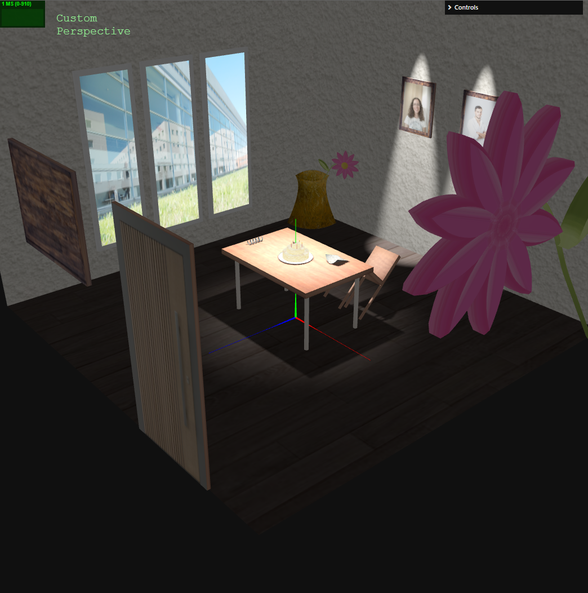
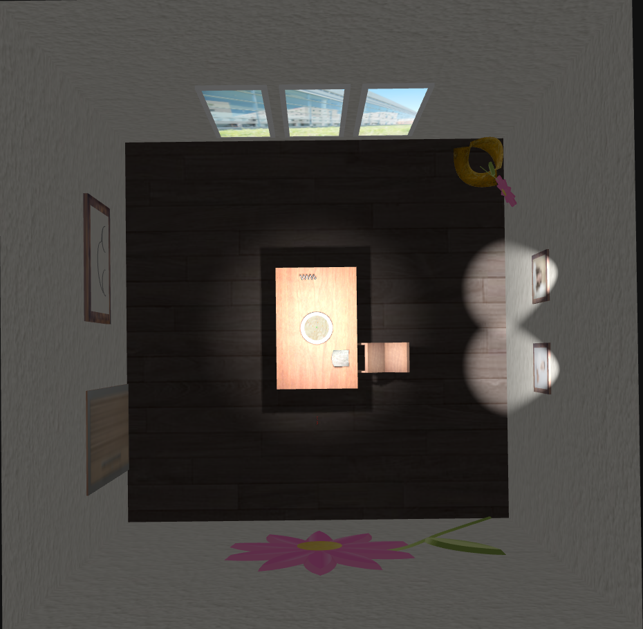
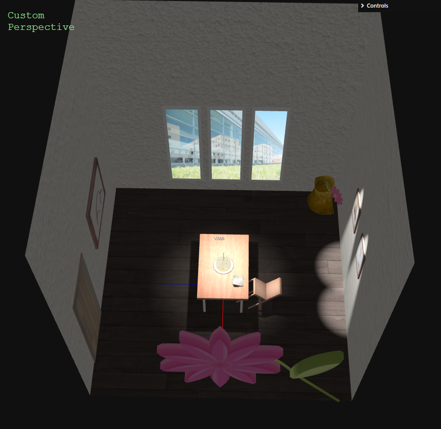
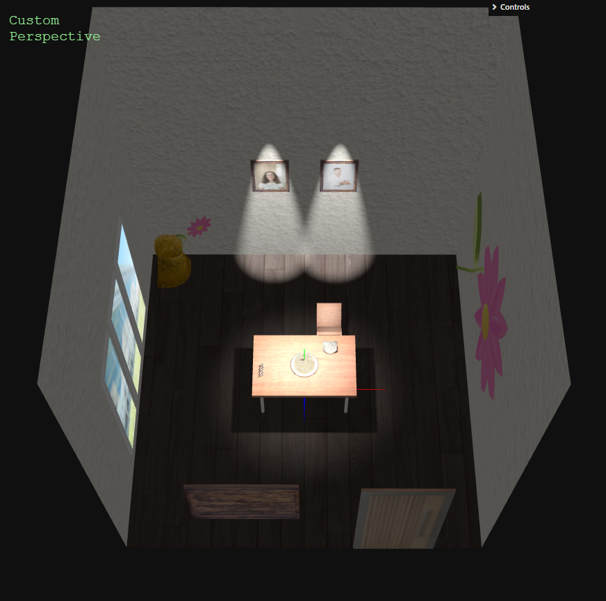
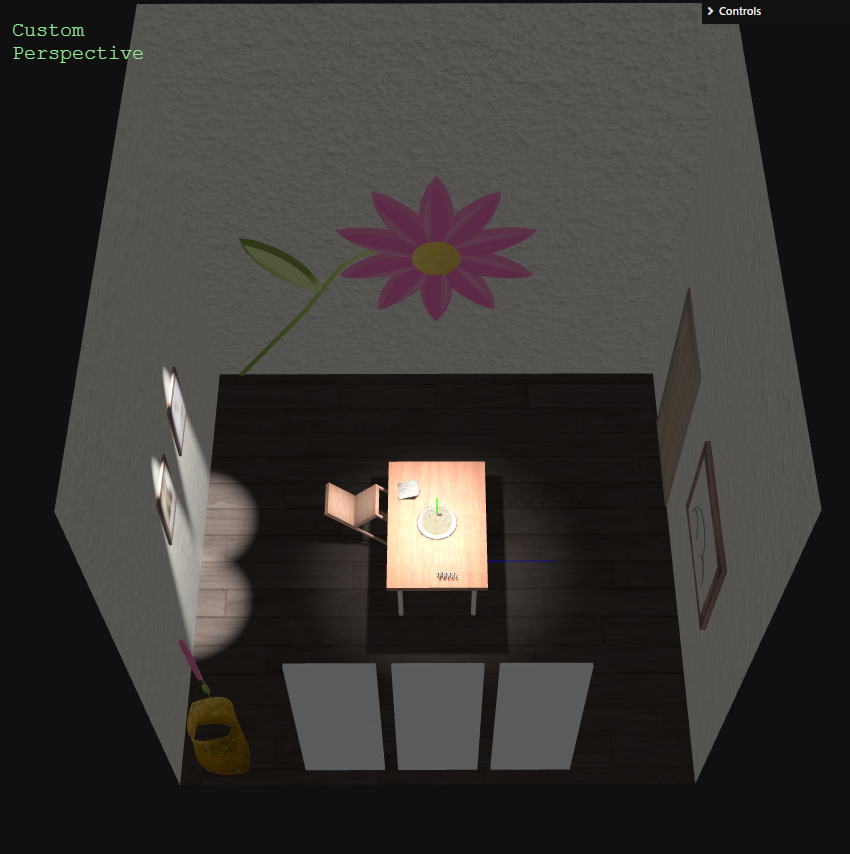
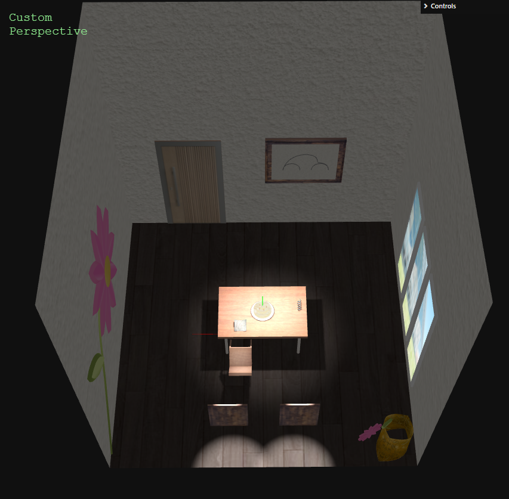
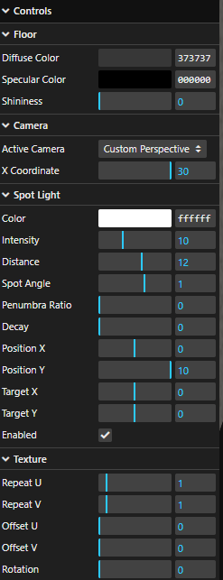

# SGI 2023/2024 - TP1

## Group T01G08

| Name               | Number    | E-Mail                   |
| ------------------ | --------- | ------------------------ |
| Sofia Costa | 202300565 | up202300565@edu.fe.up.pt |
| Nuno Alves         | 202302778 | up202302778@edu.fe.up.pt |

---

## Project information


### Strong Points
- The code is well organized in folders (objects, textures) and easy to understand.
- Interactive graphical user interface useful for controlling the cameras, centered spotlight and floor texture and material.
- Realistic materials due to the textures and materials used.
- The implemented features comply with the requirements and specific tasks demanded for the project.

### Scene
- The scene represents a 3D environment of a 4-wall room. 
- This room includes different controllable cameras via the GUI, a wood textured floor and walls with diffuse materials. 
- At the center of the scene, there is a table with a few objects on top, such as: 
  - 1 plate;
  - 1 three-layer cake with candles;
  - 1 spring;
  - 1 newspaper.
- Other objects on the scene include:
  - 2 frames positioned on the walls;
  - 3 windows;
  - 1 door;
  - 1 floor vase with a flower;
  - 1 giant painting of a flower on the wall.
- On the scene, there are a few lights:
  - 1 spotlight highlighting the table and the objects at the center;
  - 2 other spotlights, one for each picture frame.
  - 1 ambient light. 

### Screenshots
To view the scene, the file "index.html" should be opened with a Live Server extension. 

- Corner View

  

- Top View

  

- Flower Wall View

  

- Door Wall View

  

- Window Wall View

  

- Picture Frames Wall View

  

- GUI

  


## Issues/Problems

- At some point in the project, the following text line started appearing on the console: 
  ```
  GET http://127.0.0.1:5500/tp1/undefined 404 (Not Found)                       undefined:1
  ```
