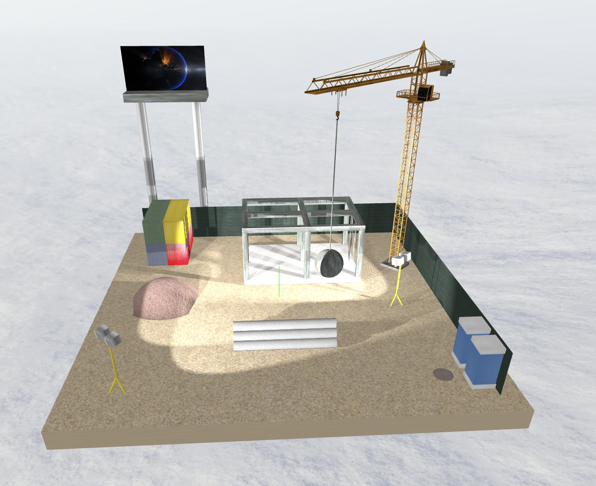
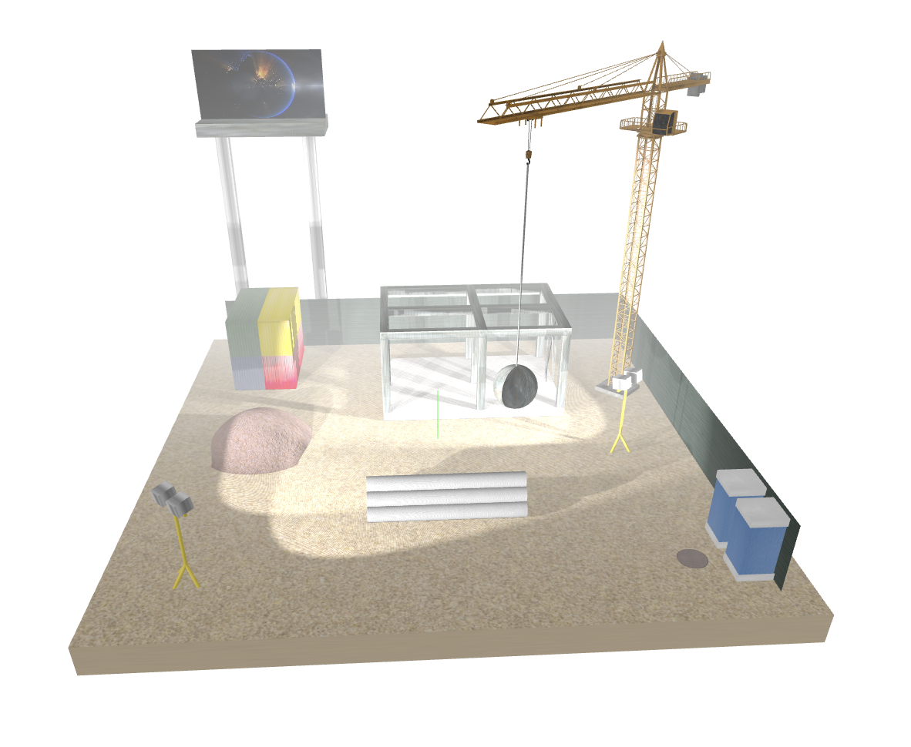
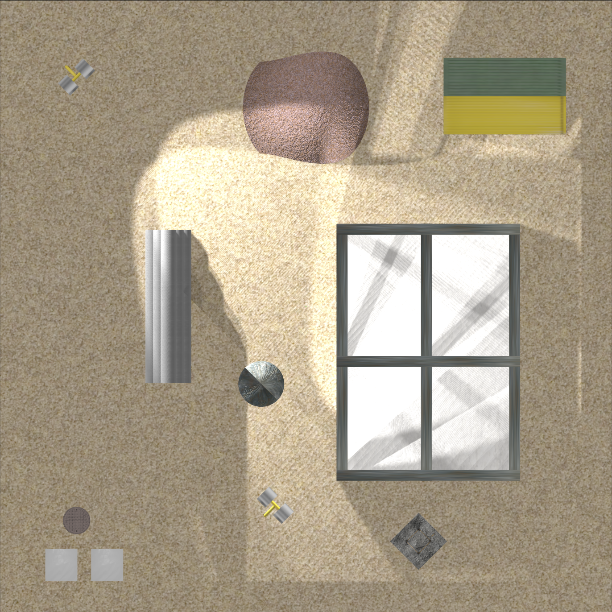
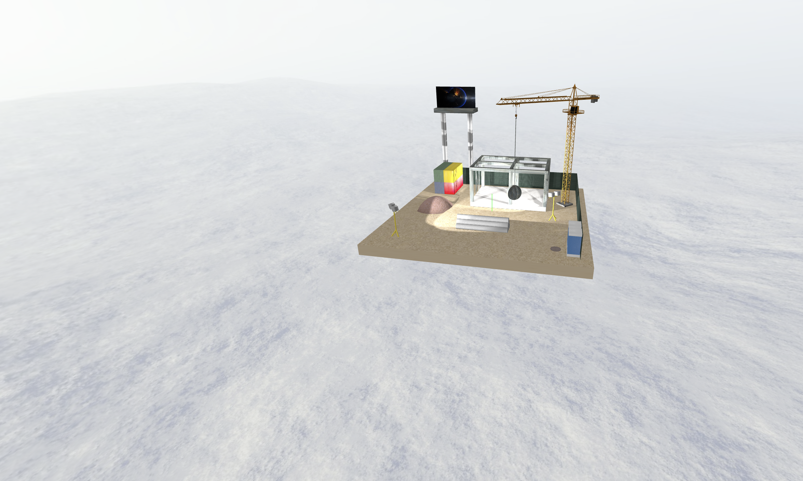
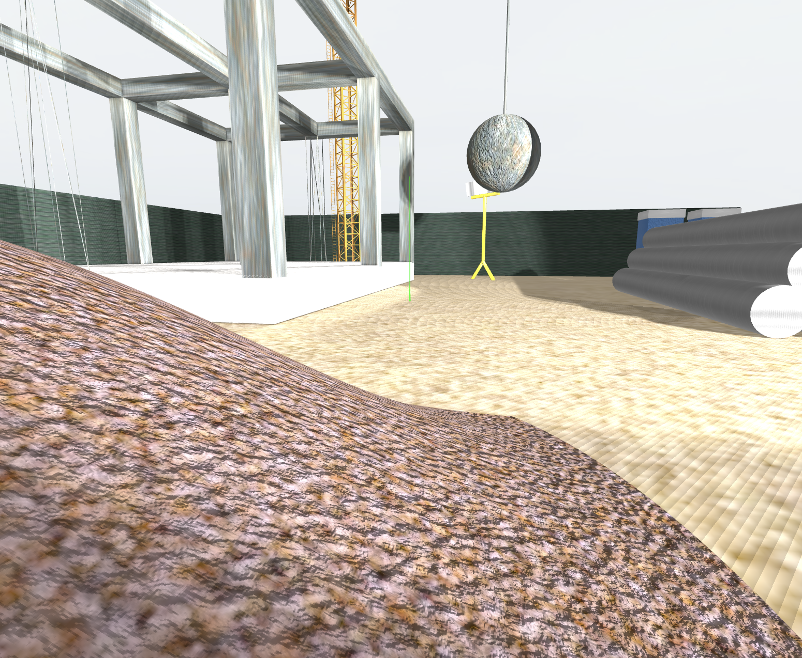
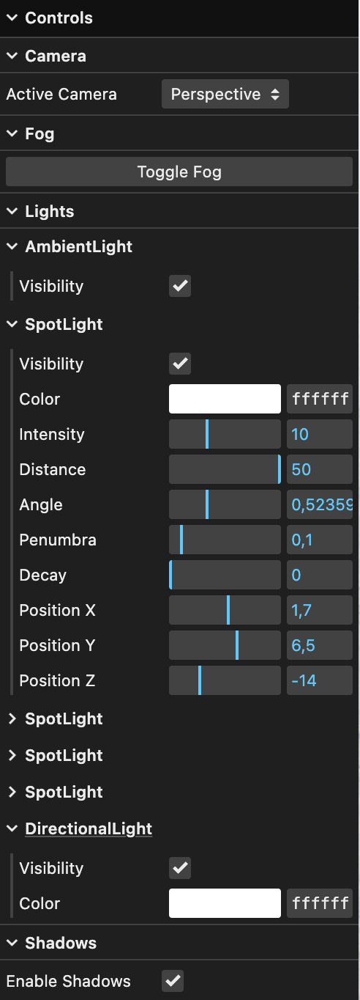

# SGI 2023/2024 - TP2

## Group T01G08

| Name               | Number    | E-Mail                   |
| ------------------ | --------- | ------------------------ |
| Sofia Merino Costa | 202300565 | up202300565@edu.fe.up.pt |
| Nuno Alves         | 202302778 | up202302778@edu.fe.up.pt |

---

## Project information

- The code is organized into folders (parser, primitives, scenes, screenshots) to make it easier to understand where everything is.
- Interactive graphical user interface (GUI) useful for controlling the scene's cameras, fog, lights, shadows and wireframes.
- Use of realistic textures and materials.
- The implemented features comply with the project's [criteria and specific tasks](#pratical-work-2---criteria) demanded for the project.

Significant project folders and files:

- **parser**:
  - MyFileReader: XML parser.
  - MySceneData: Content of a loaded scene.
- **primitives**: Stores the implementation files of each primitive. Creates the mesh and representation for each primitive.
  - My3DModel
  - MyBox
  - MyCylinder
  - MyNurbs
  - MyPolygon
  - MyRectangle
  - MySphere
  - MyTriangle
- **scenes**: Stores the folders containing the scene's information.
  - myScene
    - textures: Images used as textures for the scene's objects.
    - XML file: Describes the scene graph.
    - models: Stores the 3D models downloaded and used in the scene.
      - tower_crane
- **screenshots**: Folder with screenshots of the scene that are referenced in this README file.
- **MyRecursiveBuilder**: Builds XML scene graph recursively, applies materials and textures to each primitive created, ensuring the hierarchy between parent nodes and its children and grandchildren nodes.
- **MyCameras**: Creates the scene's defined cameras and adds them to an array of cameras.
- **MyNurbsBuilder**: Helper class to build the nurbs object.
- **MyGuiInterface**: Added GUI folders that allow interaction between the scene's cameras, fog, lights, shadows and wireframes.

## Scene

The scene describes a construction site. The construction site is composed of the following objects:

- 1 platform floor
- 2 net walls
- 1 unfinished building
- 6 metal pipes
- 1 pile of sand
- 4 storage containers
- 2 water closets
- 1 drain
- 2 spotlights
- 1 crane with a wrecking ball
- 1 advertising billboard

### Screenshots

- Scene (Perspective Camera) - Fog disabled

  

- Scene (Perspective Camera) - Fog enabled

  

- Scene (Top Camera)

  

- Skybox

  

- Bump Textures + Wireframes

  

- GUI

  

---

## Issues/Problems

- texlength_s and texlength_t were not applied like it was recommended with scale. Instead they were applied like texture.repeat.set(texlength_s, texlength_t).
- The use of ThreePhongMaterial for the skybox made the edges show up so we decided to keep the ThreeBasicMaterial and comment out the emissive and emissiveIntensity properties.

### Pratical Work 2 - Criteria

| Criteria                                                                     | Our Project                                                                                                                                                                                                                                                                                       |
| ---------------------------------------------------------------------------- | ------------------------------------------------------------------------------------------------------------------------------------------------------------------------------------------------------------------------------------------------------------------------------------------------- |
| Scene Graph (transformations, hierarchy, inheritance of properties)          | Implemented in the MyRecursiveBuilder.                                                                                                                                                                                                                                                            |
| Level of detail (at least one object; quality, number of representations...) | Applied to the building object. The more the camera distance increases, the less building group elements are loaded into the scene.                                                                                                                                                               |
| Advanced textures (sky box, mip-maps, bump-textures, video-textures)         | Applied a blizzard skybox to the scene's background using BoxGeometry. Mipmaps to the scene's platform floor (from 1024px to 8px). Bump textures to the scene's wrecking ball and sand pit. Video texture to a plane object on top of the scene's billboard (visible when using Mozilla Firefox). |
| Wireframe visualisation (at least one intermediate object/node)              | Wireframes were applied to two pillars of the scene's unfinished building.                                                                                                                                                                                                                        |
| Buffer Geometry                                                              | Used Buffer Geometry to create a circle that is representing a drain object close to the WCs of the scene.                                                                                                                                                                                        |
| Level and quality of scene control (2D interface)                            | The GUI allows the interaction of the scene's cameras, fog, lights, shadows and wireframes.                                                                                                                                                                                                                   |
| Creativity of the scene (creative use of the techniques covered; final look) | The scene describes a construction site platform with multiple objects related to this theme. The concepts and techniques learned throughout the project development were applied.                                                                                                                |
| Structuring, readability and comments/documentation of the code developed    | Code organized into different files and folders for easy readability. Comments added where it was necessary to allow a better comprehension of the code implemented.                                                                                                                              |
