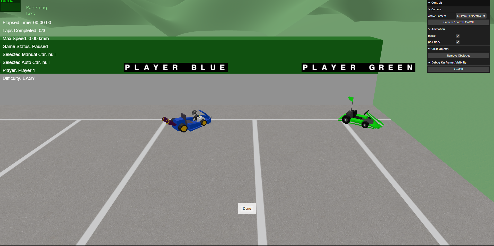

# SGI 2023/2024 - TP3

## Group T01G08

| Name               | Number    | E-Mail                   |
| ------------------ | --------- | ------------------------ |
| Sofia Merino Costa | 202300565 | up202300565@edu.fe.up.pt |
| Nuno Alves         | 202302778 | up202302778@edu.fe.up.pt |
---

## Project Information

- The code is organized into folders (MyGame, MyModels, MyTextures) to make it easier to understand where everything is.
- Interactive graphical user interface (GUI) useful for controlling the scene's cameras, autonomous car animation, clearing obstacles from scene, turn visibility of debug keyframes on and off.
- Use of low-poly textures and 3D objects (from [poly.pizza](https://poly.pizza/)).

Significant project folders and files:

- **MyGame**: stores the files responsible for all object creation and some techniques.

- **myModels**: placed inside the MyGame folder, it stores all the GLB files used for adding objects to the scene.

- **myTextures**: placed inside the MyGame folder, it stores all the textures used in the project.

- **MyReader**: This class contains the contents of the application. Interprets the information and instantiates the scene's objects, in the corresponding (x, z) positions. It also has the logic for handling event listeners and all the game menus.
- 
- **MyVehicle**: This class contains the creation of car models and all the logic that has to do with the manual car movement, collisions, etc.

## Strong Points
- The main strong points of our project are the implementation of the techniques requested:
  - Object picking with raycasting;
  - Keyframe animation with different routes for different autonomous car models;
  - Collison detection with bounding spheres;
  - Sprites with a spritesheet texture and UV mapping
  - Shaders for pulsating effect and low-relief implementation
  - Particles system for fireworks implementation
- Besides the techniques utilized, the game has various elements such as a race track, manual and autonomous cars, obstacles, power ups, outdoor and HUD display and a landscape scenary of green valleys with relief.
- Another important and strong point is the various forms of interaction with the game. The start menu, pausing and final results.

## Scene 
  - The scene describes a racing game. The game consists of a race between two cars, one controlled by the player and another that is animated autonomously. Each type of car has two different models and each has an unique color. 
  - The race track shape is inspired by the real life track of Baltar's kart track. Throughout the track there are already two types of power ups placed. The obstacles can be picked and added to the scene by the player while the game is paused.
  
      | Type     | Color  | Function              |
      |----------|--------|-----------------------|
      | Power Up | Green  | Speed boost           |
      | Power Up | Blue   | Decrease elapsed time |
      | Obstacle | Yellow | Increase elapsed time |
      | Obstacle | Yellow | Slow down             |

  - The obstacles show a pulsating effect with the use of shaders.
  - There is an outdoor display placed at a specific point in the scene, in a billboard object, that displays information such as: 
    - Elapsed time;
    - Laps completed; 
    - Max speed;
    - Game status;
  - While the game is paused, the player can add one or more obstacles to the scene. The positioning of the obstacle is done by dragging it to the desired point in the track. To improve the dragging action, it is advised to turn off (and on) the camera controls in the GUI.
  - The scene's scenario is represented by a karting track in the middle of green valleys which were implemented using Perlin noise. Other 3D objects added to the scene are:
    - trees;
    - a building;
    - a finish line banner;
    - audience seats;
    - a parking lot to display the manual and autonomous car models, and the obstacle objects used for picking by the player. All the objects in the parking lot are identified with the respective sprite.
    - billboard to display the outdoor display information;
    - another billboard that displays the karting track company name with shaders to create a low-relief three-dimensional image.
  - The number of laps is configurable and the game can be played in two difficulty modes: EASY and HARD. The difficulty is determined by the time the autonomous car takes to complete the track, which can be faster or slower. 
  - Once the laps are completed by both cars, a final results window is shown that displays the difficulty, the time each car took to complete the race and the winner of the race. Fireworks are exploded continously once the race is finished. There is a button that allows the game to restart.

## Instructions

- Write player's name.
- Pick manual car.
- Pick autonomous car.
- Configure number of laps desired.
- Start game.
- Pause the game using the "P" key.
  - When the game is paused, the outdoor display can be seen by the player.
  - There is a button that allows the player to add an obstacle.
  - Once in the obstacles parking lot, the player can pick the desired obstacles and position them by clicking the "Position obstacle" button. The player can pick more than one obstacle and then unpause the game to go back to the race.
- The "WASD" keys are used to move the car in the track. 
  - W: go forward
  - A: rotate left
  - S: go back
  - D: rotate right

---

## Screenshots

- Scene
 
- Start Menu
 
- Game Over
 
- Manual Cars Parking Lot
 
- Autonomous Cars Parking Lot
 
- Obstacles Parking Lot
 
- Position Obstacle
 
- Remaining time (Power Up)

  

## Issues/Problems

- Fireworks exploding to the side instead of up because of their changed position away from scene's origin.
- Shadows enabled for all objects and lights but still not visible in the scene.
- The obstacles were supposed to have two different colours (yellow and red) but when shaders were applied the colour was not being correctly applied and instead it stayed with the color of the last mesh created. We tried to fix this issue but in the end we were unsuccessfull. We hope to learn how to fix it once we show our work to the professor.
